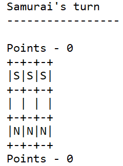
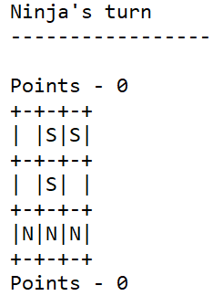
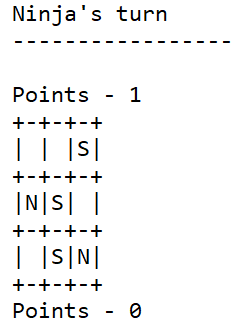

# Shi - T4G4

||||
|-|-|-|
| André Flores | 201907001 | 50% |
| Sara Marinha | 201906805 | 50% |

## Instalação e Execução

Para instalar o jogo apenas é necessário fazer *consult* do ficheiro *shi.pl* no SICStus e executar o predicado *play*

## Descrição

Shi é um jogo de <em>multiplayer</em> jogador num tabuleiro quadrado de lado variável, cada jogador começa com um número igual de peças (o número de peças e igual ao comprimento do lado) numa linha em lados opostos do tabuleiro. Os adversários chamam-se <em>Ninja</em> e <em>Samurai</em>, o jogador com a primeira jogada e definido antes da partida começar.

O objetivo do jogo é capturar as peças do adversário até que este tenha metade das suas peças iniciais, quando tal é atingido o jogador vencerá a partida. Todas as peças no jogo são do mesmo tipo e podem mover-se em qualquer direção desde que não saltem nenhuma peça e o lugar de destino esteja livre. Para executar uma captura uma peça tem se saltar por outra de mesmo tipo que está colinear com a peça atacante e a peça alvo, peças só podem saltar quando estão a capturar.

<a href=https://boardgamegeek.com/boardgame/319861/shi>Source</a>

## Lógica do Jogo

**play**

Trata-se do predicado que é responsável pelo início jogo, apresenta o menu do jogo, onde é possível selecionar o tamanho do tabuleiro e o modo de jogo, inicializa o jogo com as configurações selecionadas e invoca o ciclo de jogo.

**play_game(Game, Winner)**

Predicado onde está implementado o ciclo de jogo, faz *display* ao tabuleiro ao jogo, consoante o modo recebe input dos jogadores ou dos bots implementados e executa a jogada. Por fim verifica a condição de final do jogo, troca a vez do jogador e chama-se recursivamente. 

### Representação Interna do Estado de Jogo 

**game(Board, CapturedSamurai, CapturedNinjas, Mode, Turn, Size)**

O predicado *game* contêm:

- Board - o tabuleiro de jogo, definido numa matriz-2D (lista de listas) de peças (**piece(Type, X, Y)** Type ∈ [s (samurai), n (ninja), b (blank)]).
- CapturedSamurai - o número de peças samurai capturadas até ao momento
- CapturedNinjas - o número de peças ninja capturadas até ao momento
- Mode - o modo de jogo, selecionado no menu inicial.
- Turn - a vez do jogador.
- Size - tamanho do lado do tabuleiro selecionado no menu inicial.

### Display do Estado de Jogo

**display_game(Game)**

Escreve na consola a vez, o modo de jogo, o número de peças capturadas por cada lado e o tabuleiro de jogo (através do predicado **display_board(Board, Size)** que escreve de modo legível na consola o tabuleiro de jogo).

**initial_state(Size, Game)**

Initializa o jogo com um tabuleiro de tamanho especificado em *Size*.

#### Inputs

Os inputs do utilizador são todos validados, através dos predicados **read_until_between**.

### Jogada

**move(+Game, +Move, -NewGame)**

Validação de uma jogada passa pela verificação da sua presença na lista retornada por valid_moves. A execução altera a disposição do board, próximo jogador e o número de peças capturadas.

### Fim de Jogo

**game_over(+Game, -Winner)**

A verificação da situação de fim de jogo é dada pela captura de mais de metade das peças iniciais (definidas pelo utilizador), é feita após cada jogada e está incluída no ciclo de jogo.

### Lista de Jogadas Válidas

Obtenção de lista com jogadas possíveis. O predicado deve chamar-se .

**valid_moves(+Game, -ListOfMoves)**

A lista de jogadas válidas é criada com base na vez do jogador. Jogadas válidas:

- Joga na horizontal, vertical ou diagonal em qualquer sentido para um lugar livre desde que não salte nenhuma peça
- Exceção : se estiver a capturar tem de saltar por cima de uma peça do próprio tipo.

Exemplos do tabuleiro no estado inicial, jogada válida e jogada de captura.

### Avaliação do Estado de Jogo

Forma(s) de avaliação do estado do jogo do ponto de vista de um jogador, quantificada através do predicado value(+GameState, +Player, -Value).

**value(+Game, +Player, -Value)**

A avaliação do estado do jogo é feita pelo número de peças capturadas pelo jogador especificado no Player.

### Implementação de IA 

Escolha da jogada a efetuar pelo computador, dependendo do nível de dificuldade, através de um predicado choose_move(+GameState, +Level, -Move). O nível 1 deverá devolver uma jogada válida aleatória. O nível 2 deverá devolver a melhor jogada no momento (algoritmo míope), tendo em conta a avaliação do estado de jogo.

**choose_move(+GameState, +Level, -Move)**

- Nível 1 - Random Bot

Escolhe uma jogada aleatória da lista de jogadas válidas .

- Nível 2 - Greedy Bot

Escolhe a primeria jogada que permite capturar uma peça do adversário, se não conseguir capturar nenhuma peça escolhe a última jogada válida.

## Conclusão

Com este trabalho podemos reconhecer o potencial do paradigma declarativo da linguagem PROLOG. Como possível melhoria ao jogo implementaríamos um bot greedy mais forte que tomasse em conta as consequências de uma jogada além de se captura ou não um peça (se a peça pode ser ou não capturada após a jogada ou se torna a captura de outra peça possível).

## Bibliographia

[Descrição de Shi](https://boardgamegeek.com/boardgame/319861/shi)